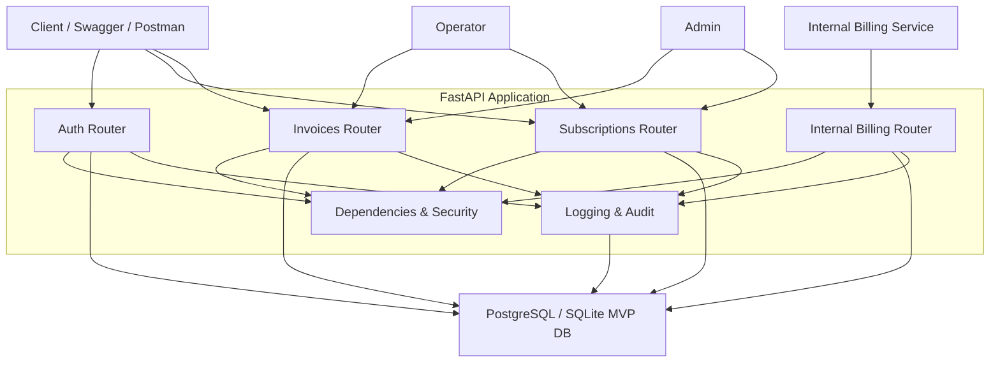
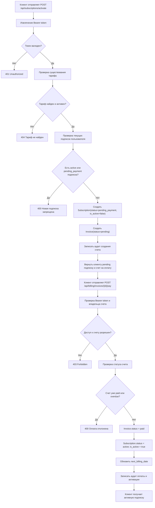

# Задание 1. Методология проверки кода безопасности

## Тема и вариант

- Тема: проектирование и реализация MVP с анализом безопасности исходного кода
- Вариант: 6, телекоммуникации
- Предметная область: регистрация абонентов, активация тарифа, выставление счетов, просмотр счетов клиентом

---

## 1. Определение области анализа

### 1.1. Анализируемые модули

- [app/main.py](/Users/tsarevich/web/telecom/app/main.py:1) — инициализация FastAPI, подключение роутеров, обработка исключений.
- [app/config.py](/Users/tsarevich/web/telecom/app/config.py:1) — конфигурация приложения и переменные окружения.
- [app/database.py](/Users/tsarevich/web/telecom/app/database.py:1) — подключение к БД и фабрика сессий.
- [app/models.py](/Users/tsarevich/web/telecom/app/models.py:1) — ORM-модели `User`, `TariffPlan`, `Subscription`, `Invoice`, `AuditLog`.
- [app/schemas.py](/Users/tsarevich/web/telecom/app/schemas.py:1) — Pydantic-схемы запросов и ответов.
- [app/security.py](/Users/tsarevich/web/telecom/app/security.py:1) — хеширование паролей, генерация и проверка JWT.
- [app/dependencies.py](/Users/tsarevich/web/telecom/app/dependencies.py:1) — Bearer-аутентификация, роли, внутренний сервисный доступ.
- [app/logging_config.py](/Users/tsarevich/web/telecom/app/logging_config.py:1) — аудит и журналирование security events с сохранением в БД.
- [app/routers/auth.py](/Users/tsarevich/web/telecom/app/routers/auth.py:1) — регистрация, вход, refresh, logout, `me`.
- [app/routers/subscriptions.py](/Users/tsarevich/web/telecom/app/routers/subscriptions.py:1) — тарифы и подписки.
- [app/routers/invoices.py](/Users/tsarevich/web/telecom/app/routers/invoices.py:1) — счета, статус счета, оплата счета.
- [app/routers/internal_billing.py](/Users/tsarevich/web/telecom/app/routers/internal_billing.py:1) — внутренний billing API для генерации следующего счета по активной подписке.

### 1.2. Анализируемые API-эндпоинты

#### Аутентификация

- `POST /api/auth/register`
- `POST /api/auth/login`
- `POST /api/auth/refresh`
- `POST /api/auth/logout`
- `GET /api/auth/me`

#### Подписки

- `GET /api/subscriptions/tariffs`
- `POST /api/subscriptions/activate`
- `GET /api/subscriptions`
- `GET /api/subscriptions/{subscription_id}`
- `GET /api/subscriptions/user/{user_id}`

#### Биллинг

- `GET /api/billing/invoices`
- `GET /api/billing/invoices/{invoice_id}`
- `GET /api/billing/invoices/{invoice_id}/status`
- `POST /api/billing/invoices/{invoice_id}/pay`
- `GET /api/billing/invoices/user/{user_id}`

#### Внутренний API

- `POST /api/internal/billing/subscriptions/{subscription_id}/generate-invoice`

### 1.3. Внешние зависимости

- `fastapi` — web API.
- `uvicorn` — ASGI server.
- `sqlalchemy` — ORM и параметризованные запросы.
- `psycopg2-binary` — драйвер PostgreSQL.
- `pydantic`, `pydantic-settings` — валидация и конфигурация.
- `passlib`, `bcrypt` — безопасное хеширование паролей.
- `python-jose`/JWT runtime в коде — подпись и проверка JWT.
- `pytest`, `httpx` — тестирование.
- `bandit`, `pip-audit` — SAST и SCA.

### 1.4. Критичные бизнес-сценарии

- Регистрация нового абонента.
- Аутентификация пользователя.
- Предоплатная активация тарифа.
- Оплата счета и перевод подписки в активное состояние.
- Просмотр счета клиентом только для собственного объекта.
- Просмотр счетов и подписок оператором поддержки.
- Генерация счета внутренним billing-сервисом.

---

## 2. Подготовка контекста

### 2.1. Активы

- База данных клиентов и их ролей.
- Тарифные планы.
- Подписки и статусы подключения услуги.
- Счета и статусы оплаты.
- JWT access и refresh tokens.
- Внутренний `INTERNAL_API_KEY`.
- Журнал аудита `audit_logs`.

### 2.2. Чувствительные данные

- Пароли пользователей.
- JWT токены.
- Телефон и email клиента.
- Внутренний API key для billing API.
- IP-адреса и следы действий в аудите.

### 2.3. Роли

- `customer` — клиент, видит только собственные данные и оплачивает свои счета.
- `operator` — сотрудник поддержки, имеет read-only доступ к счетам и подпискам клиентов.
- `admin` — расширенный служебный доступ.
- `internal billing service` — технический сервис, который генерирует очередные счета по активным подпискам.

### 2.4. Границы доверия

- Внешний клиент ↔ HTTP API.
- HTTP API ↔ JWT/Bearer authentication layer.
- HTTP API ↔ База данных PostgreSQL.
- Internal billing service ↔ internal billing API.
- Приложение ↔ журналирование и аудит в БД.

### 2.5. Вероятные угрозы

- SQL injection.
- IDOR при доступе к чужому счету или подписке.
- Подмена или кража токена доступа.
- Использование refresh token не по назначению.
- Захардкоженные секреты.
- Утечки ПДн через API или логи.
- Повышение привилегий.
- Неверная модель активации тарифа без оплаты.
- Несанкционированный вызов внутреннего billing API.

---

## 3. Построение алгоритма системы и ключевого сценария

### 3.1. Структурная схема MVP



### 3.2. Блок-схема ключевого сценария

Ключевой сценарий выбран в предоплатной модели:

`Клиент выбирает тариф → получает счет → оплачивает счет → подписка активируется`



---

## 4. Выделение критичных участков кода

### 4.1. Пользовательский ввод

- Регистрация: [app/schemas.py](/Users/tsarevich/web/telecom/app/schemas.py:6)
- Вход: [app/schemas.py](/Users/tsarevich/web/telecom/app/schemas.py:39)
- Refresh token: [app/schemas.py](/Users/tsarevich/web/telecom/app/schemas.py:56)
- Активация тарифа: [app/schemas.py](/Users/tsarevich/web/telecom/app/schemas.py:106)
- Path-параметры `invoice_id`, `subscription_id`, `user_id`: [app/routers/invoices.py](/Users/tsarevich/web/telecom/app/routers/invoices.py:43), [app/routers/subscriptions.py](/Users/tsarevich/web/telecom/app/routers/subscriptions.py:149)

### 4.2. Решения о доступе

- Bearer-аутентификация: [app/dependencies.py](/Users/tsarevich/web/telecom/app/dependencies.py:15)
- Проверка роли `admin`: [app/dependencies.py](/Users/tsarevich/web/telecom/app/dependencies.py:54)
- Проверка роли `operator`: [app/dependencies.py](/Users/tsarevich/web/telecom/app/dependencies.py:67)
- Внутренний billing API key: [app/dependencies.py](/Users/tsarevich/web/telecom/app/dependencies.py:96)
- Object-level access к счетам: [app/routers/invoices.py](/Users/tsarevich/web/telecom/app/routers/invoices.py:72)
- Object-level access к подпискам: [app/routers/subscriptions.py](/Users/tsarevich/web/telecom/app/routers/subscriptions.py:169)

### 4.3. Доступ к БД

- Создание пользователей: [app/routers/auth.py](/Users/tsarevich/web/telecom/app/routers/auth.py:103)
- Поиск пользователя по username: [app/routers/auth.py](/Users/tsarevich/web/telecom/app/routers/auth.py:158)
- Создание подписки и счета: [app/routers/subscriptions.py](/Users/tsarevich/web/telecom/app/routers/subscriptions.py:85)
- Оплата счета и активация подписки: [app/routers/invoices.py](/Users/tsarevich/web/telecom/app/routers/invoices.py:192)
- Генерация следующего счета внутренним сервисом: [app/routers/internal_billing.py](/Users/tsarevich/web/telecom/app/routers/internal_billing.py:16)
- Аудит в таблицу `audit_logs`: [app/logging_config.py](/Users/tsarevich/web/telecom/app/logging_config.py:28)

### 4.4. Токены, пароли и секреты

- Хеширование паролей: [app/security.py](/Users/tsarevich/web/telecom/app/security.py:11)
- JWT access token: [app/security.py](/Users/tsarevich/web/telecom/app/security.py:21)
- JWT refresh token: [app/security.py](/Users/tsarevich/web/telecom/app/security.py:43)
- Проверка JWT: [app/security.py](/Users/tsarevich/web/telecom/app/security.py:58)
- `SECRET_KEY` и `INTERNAL_API_KEY`: [app/config.py](/Users/tsarevich/web/telecom/app/config.py:5), [.env.example](/Users/tsarevich/web/telecom/.env.example:1)

---

## 5. Анализ потоков данных

### Ключевой сценарий: просмотр счета клиентом

#### Цепочка `source → propagation → sink → sanitization`

1. `source`

- Пользовательский запрос `GET /api/billing/invoices/{invoice_id}`
- Источники данных:
  - `Authorization: Bearer <access_token>`
  - path parameter `invoice_id`

2. `propagation`

- Bearer token извлекается в [app/dependencies.py](/Users/tsarevich/web/telecom/app/dependencies.py:15)
- Токен декодируется в [app/security.py](/Users/tsarevich/web/telecom/app/security.py:58)
- Из payload извлекается `sub`, приводится к `int`
- По `sub` ищется пользователь в БД
- Затем в [app/routers/invoices.py](/Users/tsarevich/web/telecom/app/routers/invoices.py:62) по `invoice_id` запрашивается счет

3. `sink`

- SQLAlchemy-запрос к таблице `invoices`
- Возврат объекта счета клиенту

4. `sanitization`

- JWT проверяется на подпись и срок жизни
- `invoice_id` типизирован FastAPI как `int`
- Выполняется проверка object-level access:
  - владелец счета;
  - либо `operator`;
  - либо `admin`
- Ответ сериализуется через `InvoiceResponse`, без email, phone и других ПДн

### Краткая схема потока

```text
HTTP Request
  -> Authorization Header + invoice_id
  -> get_current_user()
  -> verify_token()
  -> db.query(User)
  -> db.query(Invoice)
  -> object-level authorization
  -> InvoiceResponse
  -> JSON Response
```

---

## 6. Проверка защитных механизмов

### 6.1. Аутентификация

- Пароли хранятся в виде bcrypt-хеша.
- Access token и refresh token имеют ограниченный TTL.
- Реализован `refresh` endpoint.
- Реализован `logout`.
- Bearer token извлекается из `Authorization` header.
- Есть базовая защита от brute-force по username в памяти процесса.

**Статус:** частично соответствует.  
**Замечание:** защита от brute-force не распределённая и не переживает перезапуск приложения.

### 6.2. Авторизация

- Проверка роли выполняется на серверной стороне.
- Реализована object-level authorization для счетов и подписок.
- Роль `operator` выделена в read-only сценарии поддержки.
- Внутренний billing API отделен от пользовательского API и защищен отдельным ключом.
**Статус:** в основном соответствует.

### 6.3. Валидация

- Регистрация валидирует username, email, phone, password.
- Активация тарифа валидирует `tariff_id > 0`.
- Все обращения к БД используют ORM-запросы, а не конкатенацию SQL.

**Статус:** соответствует.

### 6.4. Журналирование

- Критичные действия пишутся в обычный лог.
- Критичные действия и security events сохраняются в таблицу `audit_logs`.
- В лог не пишутся пароли, токены и полные ПДн.

**Статус:** соответствует.

### 6.5. Обработка ошибок

- Есть глобальный обработчик `HTTPException`.
- Есть обработчик `SQLAlchemyError`.
- Сообщения об ошибках в чувствительных местах нейтральные.

**Статус:** частично соответствует.  
**Замечание:** импорт-time инициализация БД ухудшает устойчивость и тестируемость.

### 6.6. Криптография

- Для паролей используется `bcrypt`.
- Для токенов — JWT с подписью `HS256`.
- Токены имеют срок жизни.
- Внутренний API key вынесен в конфигурацию.

**Статус:** частично соответствует.  
**Замечание:** в коде остаются небезопасные дефолтные значения `secret_key` и `database_url`, которые нужно убрать из исходников.

---

## 7. Фиксация находок

### Таблица находок

| № | Файл / модуль | Место | Тип проблемы | Риск | Последствие | Критичность | Исправление | Статус |
|---|---|---|---|---|---|---|---|---|
| 1 | `app/main.py` | `Base.metadata.create_all()` при импорте | Небезопасная инициализация / плохая изоляция окружения | Средний | Тесты и CI ломаются, приложение зависит от доступности реальной БД уже на этапе импорта | Высокая | Перенести создание таблиц в lifespan/init script, не выполнять при импорте модуля | Не устранено |
| 2 | `app/config.py` | дефолтные `database_url`, `secret_key` | Захардкоженные секреты / insecure defaults | Средний | При ошибочной конфигурации приложение стартует с небезопасными значениями | Высокая | Убрать реальные значения из кода, требовать `.env`, валидировать наличие секретов на старте | Не устранено |
| 3 | `app/routers/auth.py`, `app/security.py`, `app/dependencies.py` | Bearer/JWT flow | Некорректная аутентификация | Высокий | `GET /api/auth/me` не проходил даже с валидным токеном | Высокая | `sub` записывается как строка, token читается из Bearer header, `sub` приводится к `int` | Устранено |
| 4 | `app/routers/subscriptions.py` | маршруты подписок | Несоответствие контракту API | Средний | README, тесты и фактические пути расходились | Средняя | Исправлены пути до `/api/subscriptions/activate`, `/api/subscriptions`, `/api/subscriptions/{id}` | Устранено |
| 5 | `app/routers/auth.py` | отсутствовали `refresh` и `logout` | Неполная реализация auth lifecycle | Средний | Невозможно корректно показать работу refresh/logout в MVP | Средняя | Добавлены `POST /api/auth/refresh` и `POST /api/auth/logout` | Устранено |
| 6 | `app/models.py`, `app/logging_config.py` | `AuditLog` был не использован | Неполный аудит | Средний | Критичные действия не сохранялись в БД как артефакт безопасности | Средняя | Добавлено сохранение audit/security events в `audit_logs` | Устранено |
| 7 | `app/routers/subscriptions.py`, `app/routers/invoices.py` | бизнес-логика подписки | Некорректная модель активации тарифа | Средний | Неоплаченный тариф мог оставаться активным | Средняя | Введена предоплата: `pending_payment` → оплата счета → `active` | Устранено |
| 8 | `app/routers/internal_billing.py`, `app/dependencies.py` | внутренний billing API | Недостаточная изоляция внутреннего API | Средний | Служебная генерация счета могла быть смешана с пользовательскими ролями | Средняя | Выделен internal router и защита по `X-Internal-API-Key` | Устранено |
| 9 | `app/routers/auth.py` | brute-force хранится в памяти процесса | Ограниченная устойчивость защитного механизма | Низкий | После рестарта блокировки теряются, в нескольких инстансах защита не синхронизирована | Низкая | Вынести rate limit в Redis / reverse proxy | Не устранено |

### Комментарий к текущему состоянию

С точки зрения учебного MVP большинство критичных логических и security-проблем уже устранены, но два важных остаточных риска остаются:

- инициализация БД при импорте модуля;
- небезопасные default values для конфигурации.

---

## 8. Подготовка рекомендаций

### 8.1. Рекомендации в коде

- Оставить только параметризованные ORM-запросы и не использовать конкатенацию SQL.
- Сохранить object-level authorization для всех ресурсов с `user_id`.
- Для `customer`, `operator`, `admin` держать отдельные серверные правила доступа.
- Не активировать подписку до оплаты первого счета.
- Для внутренних billing-операций использовать отдельный internal endpoint и service credential, а не JWT пользователя.
- Продолжить писать аудит в БД и в обычный лог.

### 8.2. Рекомендации по конфигурации

- Убрать дефолтные секреты из исходного кода.
- Требовать `SECRET_KEY`, `DATABASE_URL`, `INTERNAL_API_KEY` из `.env`.
- Не использовать для БД superuser-учетную запись в production.
- Разделить права пользователя БД для приложения и административных задач.

### 8.3. Рекомендации по зависимостям

- Зафиксировать и актуализировать JWT-библиотеку в `requirements.txt`, чтобы код и зависимости совпадали.
- Запустить `pip-audit` в рабочем окружении с доступом в интернет.
- Запустить `bandit -r app/` в корректно собранном виртуальном окружении.
- Исправить найденные high/critical уязвимости до сдачи.

### 8.4. Рекомендации по тестированию

- Исправить [app/main.py](/Users/tsarevich/web/telecom/app/main.py:15), чтобы тесты могли запускаться без реальной БД при импорте.
- Добавить тесты на:
  - `refresh`;
  - `logout`;
  - предоплатный сценарий;
  - оплату счета;
  - внутренний billing API;
  - роли `operator` и `admin`.

---

## Итог

По результатам анализа проект представляет собой защищённый учебный MVP телеком-системы с аутентификацией, авторизацией, валидацией, аудитом, внутренним billing API и предоплатной моделью активации тарифа. Ключевые проблемы, мешавшие соответствию требованиям, в основном устранены. Остаточные задачи для доведения до полностью зрелого состояния:

- убрать инициализацию БД при импорте приложения;
- убрать небезопасные дефолтные секреты из исходников;
- привести запуск тестов, `bandit` и `pip-audit` к воспроизводимому состоянию.
